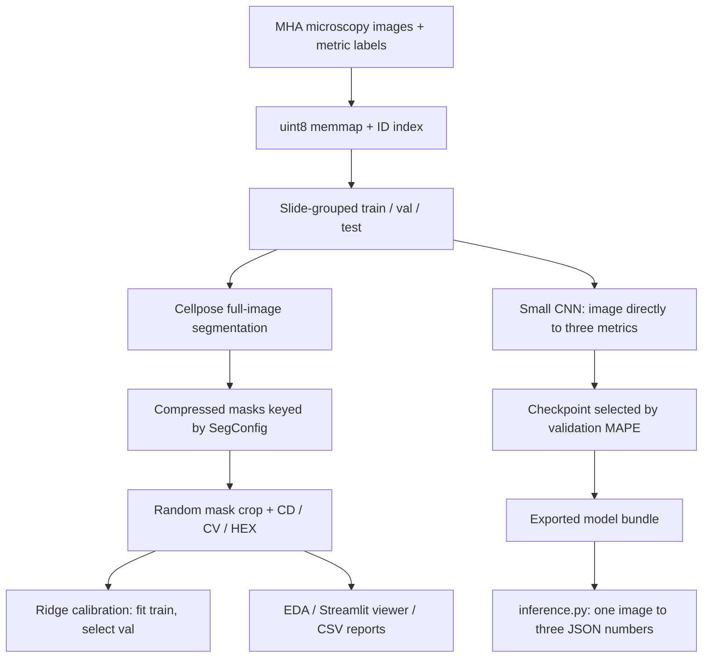

# CLEAR-EC readiness audit — 2026-09-11

## Verdict

The machine can support fast local experimentation. The original experiment
pipeline was not trustworthy enough for aggressive sweeps: CNN checkpoint
selection was broken, limited runs could replace shared data/artifacts, and
several configuration paths were inconsistent. Those concrete defects have
been repaired and tested. This is now a usable local experiment foundation,
not a fully managed experiment platform.

A bounded ten-epoch run after the repairs produced **12.51% mean validation
error**, versus **14.17%** for a training-only constant baseline and **14.43%**
for the saved ridge calibration. No new test-set scoring was performed.
Qualification for Phase II cannot be inferred from these local scores.

## How the pipeline is built



Cellpose is the **installed 1.0.2 package**, not the similarly named vendored
source directory. There is no trained task-specific cell segmentation model.
The CNN learns image-level metric regression; it does not need cell masks.
The viewer is a local inspection tool, not the submission interface.

The dataset contains 9,000 grayscale 972×1296 images, with 7,202 / 892 / 906
images in train / val / test. The image cache is a raw uint8 memmap of about
10.56 GiB despite its `.npy` suffix; it is not a normal `np.load` NPY file.
The tuned diameter-40 segmentation cache already covers all 9,000 images.

## Findings and fixes

| Priority | Finding | Disposition |
|---|---|---|
| Critical | `_run_epoch` reconstructed ground truth from normalized float32 targets. A true zero HEX label became a tiny positive value, leading to enormous MAPE and invalid checkpoint selection. Saved best epoch scores were 532,566–585,128%, while final CSV scores were 16–23%. | Fixed: epoch scoring joins original labels by cache index, preserving loader shuffle order. Regression test covers exact-zero targets. |
| Critical | `run_experiment --limit` passed the limit to shared cache construction, potentially replacing the full dataset and leaving stale masks tied to different indices. | Fixed: limit applies only to experiment indices. Cache reuse checks identity/order and byte size, preserves existing splits, and refuses implicit replacement. Rebuilds with derived artifacts require a new directory. |
| High | A limited metric sweep wrote the same `val.csv` as a full sweep. | Fixed: partial artifacts use `val.limit_N.csv`. |
| High | `run_experiment` looked for obsolete flat prediction filenames after sweeps wrote split-specific directories. | Fixed: common artifact-path helper and unrounded scoring. End-to-end limited run tested. |
| High | Overnight `--batch_size` changed worker settings without changing the configuration used for cache hashes. | Fixed: materialize matching configurations throughout the runner. |
| High | Inner-join scoring could report excellent results from incomplete predictions; duplicate IDs could multiply rows; invalid values were not consistently rejected. | Fixed: optional exact expected-ID coverage is enforced in experiment, calibration, and regression paths; duplicates and nonfinite values are rejected. Legacy callers that omit expected IDs still support subset joins. |
| High | CNN checkpoint and history were written only at the end. A killed run lost the best result. | Fixed: atomic best-checkpoint saves and per-epoch history. Existing checkpoint directories are protected. This does not add optimizer-state resume. |
| High | Model training and container inference were disconnected. | Added explicit checksum-verified regression bundles, an exporter, and loading in `inference.py`. Missing bundle retains the baseline; malformed bundles fail rather than silently switching methods. |
| High | Four exact image-duplicate pairs cross train/test despite slide-disjoint splits. | Detected by hashing every cached image. All four are train/test, none train/val. Splits were preserved. Old test confidence must be qualified; exact duplicate detection does not rule out near-duplicates or donor-level overlap. |
| Medium | Sparse mask labels caused `calculate_hexagonality` to index beyond regionprops; cell count used the maximum label. | Fixed: iterate actual regions and count actual cells. |
| Medium | Crop documentation claimed centroid selection, but code slices masks and counts partial cells. | README corrected. Baseline semantics preserved for cache/result comparability; alternative boundary treatment should be an explicit experiment. |
| Medium | Crop relabeling scanned every pixel once per cell, and sweeps reread masks for every crop configuration. | Vectorized relabeling; sweeps decode each mask once and evaluate configurations with configurable CPU processes. |
| Medium | Mask and manifest writes could be partially read or lose concurrent method entries. | Atomic mask/artifact writes and locked manifest updates. Concurrent computation of the same uncached mask is still not deduplicated. |
| Medium | A segmentation exception could silently remove an image from a run. | Fail with image context rather than silently scoring survivors. |
| Medium | `_fit_ridge` skipped regularizing the first coefficient even when there was no intercept. | Fixed and covered by an analytical test. |
| Medium | `evaluate.py --split val` still defaulted to a test prediction filename. | Fixed; scores no longer round individual errors before averaging. |
| Medium | Docker context included the 5.8 GiB local virtualenv and could include an intermediate image tar during export. | Added exclusions, preserving the pre-existing viewer exclusions. |
| Medium | Hand-written MHA reader decoded big-endian values incorrectly. | Fixed and tested with known uint16 values. |

## Hardware and measured throughput

- Two NVIDIA RTX A5000 GPUs, 24 GiB each; driver 580.173.02.
- Xeon W-3245: 16 physical cores / 32 threads.
- About 92 GiB total RAM, 76 GiB available at audit start; 1.2 TiB disk free.
- Local Python 3.12, PyTorch 2.13.0 / CUDA 13.0, Cellpose 1.0.2.
- Container Python 3.10, PyTorch 2.1.2 / CUDA 12.1. `torchvision` is absent
  from the local environment; don't assume pretrained torchvision backbones
  can be used without environment work.

The CNN is small. Transferring full-resolution float32 images, then immediately
downsampling them on the GPU, wasted transfer bandwidth. The updated path can
transfer uint8 and normalize on the GPU. CPU thread and loader-worker counts,
batch size, downsampling, loss, AMP, and channels-last are now CLI options.
AMP is opt-in because it was not faster here.

Warmed benchmark: 512 training images, four data-loader workers, GPU 1, median
of two passes after one warm-up. All rows use the revised epoch loop; these
are controlled input/batch comparisons, not a claim of end-to-end speedup
over every historical run.

| Input / batch | AMP | Images/sec | Peak allocated GPU memory |
|---|---|---:|---:|
| float32 / 8 | No | 467 | 141 MiB |
| uint8 / 8 | No | 692 | 112 MiB |
| uint8 / 32 | No | **1,528** | 380 MiB |
| uint8 / 32, channels-last | Yes | 1,372 | 230 MiB |
| uint8 / 64, channels-last | Yes | 1,172 | 438 MiB |

Start with **batch 32, four loader workers, four CPU threads, FP32** for this
CNN. Batch size changes optimization and must be validated for accuracy.
Run independent configurations on the two GPUs rather than splitting this
tiny network across them. Reserve CPU cores for masks and metric sweeps.

Fresh diameter-40 Cellpose inference took 0.55–0.83 seconds/image across three
validation cases, with bit-identical masks to the existing cache. This is a
small sample, not a whole-dataset runtime guarantee. Two crop settings over
128 cached validation images took about 3.6 seconds of metric work with four
workers. Full CNN train+validation epochs were approximately 4.4–5.0 seconds
in the bounded run (46.1 seconds across ten epochs).

Reproduce throughput from `code/`:

```bash
.venv/bin/python scripts/benchmark_local.py --gpu 1 --limit 512 \
  --output ../results/benchmark.json
```

## Model evidence

All rows below use the same existing 892-image validation partition. Lower
mean absolute percentage error is better.

| Model | CD | CV | HEX | Mean |
|---|---:|---:|---:|---:|
| Training-only weighted-median constants | 14.40 | 15.36 | 12.76 | 14.17 |
| Saved ridge calibration | 14.36 | 15.94 | 12.99 | 14.43 |
| Best saved old CNN (seed 44) | 20.26 | 17.50 | 12.98 | 16.91 |
| Corrected ten-epoch CNN, seed 42 | 12.50 | 13.17 | 11.86 | **12.51** |

The constant baseline fits each metric's weighted median on train, with
weight 1/target for positive targets to match MAPE; outputs are CD=2778,
CV=0.36, HEX=0.53. It shows why improvement over raw Cellpose alone is an
insufficient success criterion.

The new run changed checkpoint selection and throughput settings, including
batch size. It is not an isolated accuracy ablation of a single fix. The best
epoch was 9; validation fluctuated from roughly 12.5% to 21.5%. BatchNorm,
optimization settings, and loss alignment are priority experiments, not
proven diagnoses. The previous final CSV scores remain valid for their
saved checkpoints, but those checkpoints were selected with a broken metric.

Checkpoint: `results/audit_20260911/selection_fix/regression_cnn/seed_42/best_model.pt`.
Exported bundle: `code/model/` (local, ignored by Git).
Evidence: `results/audit_20260911/evidence/`.

## Submission and validation status

- 35 unit/regression tests pass, including original protocol tests.
- Python compilation and `git diff --check` pass.
- Limited experiment CLI completed, retained 9,000 cache rows, and matched
  existing cached metrics exactly for all eight selected cases.
- Three real validation images matched MHA/cache pixels, freshly computed
  masks, and metrics exactly.
- Docker image `clear_ec_audit:local` built successfully.
- Both the original baseline and new regression bundle completed actual
  offline GPU container forward passes, producing three finite JSON scalars.
- For the new model, first-case outputs matched local output exactly across
  the two PyTorch environments: CD 2738.609619, CV 0.43218735, HEX 0.50061125.
- All 892 validation images were also evaluated through the container's model
  implementation with batch size 1: **12.508813%** mean error, versus
  **12.508824%** in the saved local validation CSV. This used cached image
  pixels; the separate forward-pass smoke test exercised MHA decoding and
  the JSON interface.
- No upload, official submission, leaderboard check, or new test-set evaluation
  was performed. The local `do_test_run.sh` fixtures are still absent; the
  audited smoke fixture lives under `/tmp/clear-ec-audit/input`.

Export another selected checkpoint into a **new** directory:

```bash
cd code
.venv/bin/python scripts/export_regression.py \
  --checkpoint_dir ../results/your_run/regression_cnn/seed_42 \
  --output_dir ../results/your_bundle
```

Mount that directory at `/opt/ml/model` for inference. For the provided
`do_save.sh`, the selected bundle must be in `code/model/`. Archive export and
platform acceptance still need verification; a successful Docker run is not
an uploaded submission.

## Remaining limitations and a 24-hour plan

1. **First 2 hours: establish a recoverable candidate.** Preserve the new model,
   verify all validation cases with the container's one-image behavior, and
   prepare/upload a valid algorithm and model bundle once selected. Check the
   actual portal deadline, resource limits, and upload status early.
2. **Hours 2–8: cheap model comparisons on both GPUs.** Re-run corrected CNNs
   across several seeds. Compare BatchNorm versus GroupNorm, learning rates,
   input resolution, and a loss aligned with per-metric relative error. Keep
   the constant baseline in every table. Evaluate modest validation-selected
   blends only after saving individual predictions.
3. **Hours 2–8, CPU alongside GPU work:** reuse cached masks to compare full
   image versus random crop and explicitly defined cell-boundary treatments.
   Try train-fitted, standardized morphology/image-feature regressors and
   calibration suited to MAPE. Do not spend hours recomputing the existing
   diameter-40 masks. Any changed metric semantics need distinct artifact
   names/directories; the current hash contains configuration, not code.
4. **Hours 8–16: expand only promising approaches.** Confirm improvements across
   seeds and meaningful image/slide subgroups. Inspect low-density and poor
   image-quality errors. Consider additional segmentation configurations only
   if existing features show useful predictive value. Freeze all choices on
   validation before using a test score.
5. **Final 8 hours: stop architecture churn.** Verify one-image deployment,
   output ranges/units, offline weights, archive export, runtime, and upload.
   Leave time for platform processing and recovery. Any held-out audit must
   disclose the four train/test duplicate pairs and prior test access.

Further engineering gaps: cache hashes omit code/model-weight fingerprints;
there is no full optimizer-state resume or bounded experiment scheduler;
image bootstrap intervals ignore slide clustering; missing GPU behavior in
CNN training still falls back to CPU; unusual image dtypes are cast to uint8
and need an explicit tested policy before extending beyond the released data.
Neither exact-duplicate hashing nor slide IDs establish donor independence.
The current benchmark and fixes do not validate arbitrary future models.

The public [challenge page](https://clear-ec.grand-challenge.org/) currently
lists September 14, end-of-day, and at most three Phase I submissions, with
the top five teams advancing. The user's stricter 24-hour window was used for
this plan. The same page confirms the equal-weight mean of CD/CV/HEX percent
errors as the ranking objective. PyTorch's [performance guide](https://docs.pytorch.org/tutorials/recipes/recipes/tuning_guide.html)
and [AMP documentation](https://docs.pytorch.org/docs/stable/amp.html) informed
the bounded throughput checks; measured local results determined defaults.
